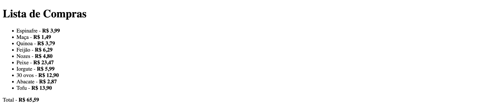
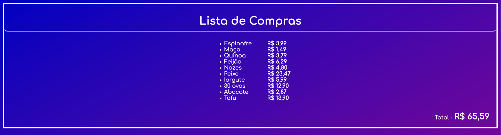

# Exercício de Tabela de Compras

Este repositório contém um exercício de criação de uma tabela de compras, utilizando HTML Básico. Adicionalmente, inclui uma versão alternativa com CSS para prática pessoal.

## Descrição dos Arquivos

1. **index.html**: Este arquivo contém a implementação básica da tabela de compras conforme solicitado.
2. **index2.html**: Este arquivo é uma versão alternativa onde adicionei pequenas alterações no estilo, utilizando o arquivo `style.css` para praticar conceitos aprendidos de CSS.
3. **style.css**: Este arquivo contém o CSS utilizado para estilizar o `index2.html`.
4. **src**: Esta pasta contém as imagens utilizadas para apresentar a ilustração do arquivo `README.md`.
5. **README.md**: Este arquivo contém informações sobre o repositório em questão.
## Visualização dos Exercícios

Para visualizar os arquivos HTML no seu navegador, siga as instruções abaixo:

1. Faça o clone deste repositório para o seu ambiente local:
    ```sh
    git clone https://github.com/umcertodiego/exercicio-tabela-de-compras.git
    ```
2. Navegue até o diretório do repositório clonado:
    ```sh
    cd exercicio-tabela-de-compras
    ```
3. Abra o arquivo `index.html` para visualizar a versão básica ou `index2.html` para visualizar a versão com CSS no seu navegador preferido.

## Screenshots

### index.html


### index2.html


---

Se houver alguma dúvida ou problema, sinta-se à vontade para entrar em contato.

---

Este `README.md` fornece uma descrição clara e detalhada do projeto, explicando o propósito de cada arquivo e como visualizar o resultado.
